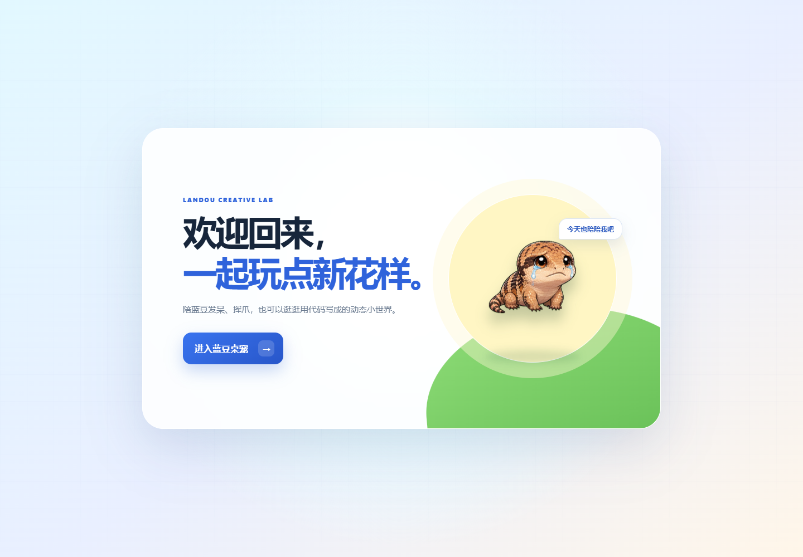
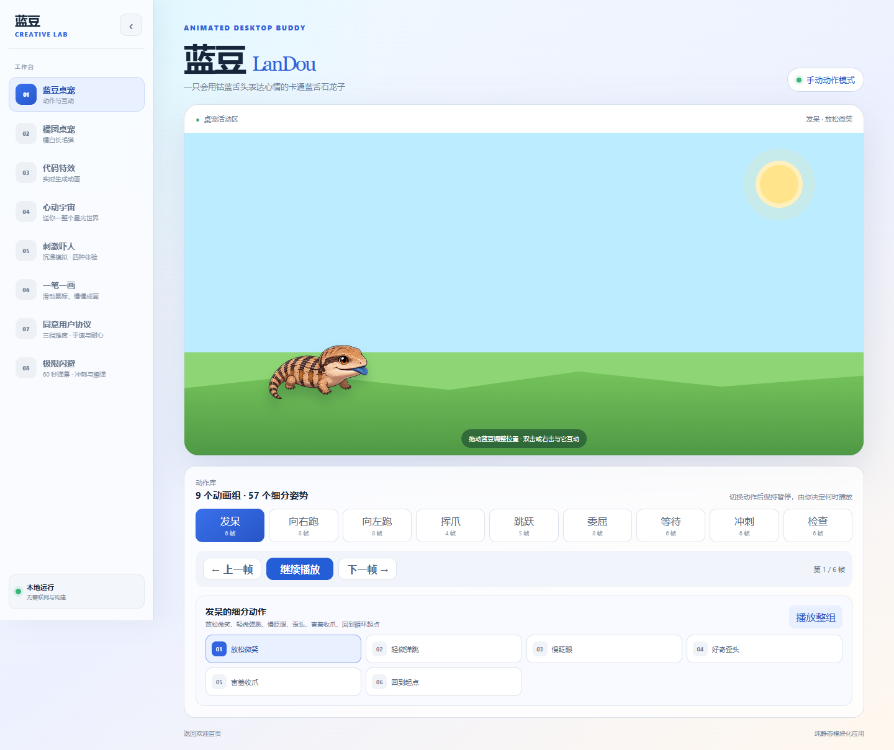
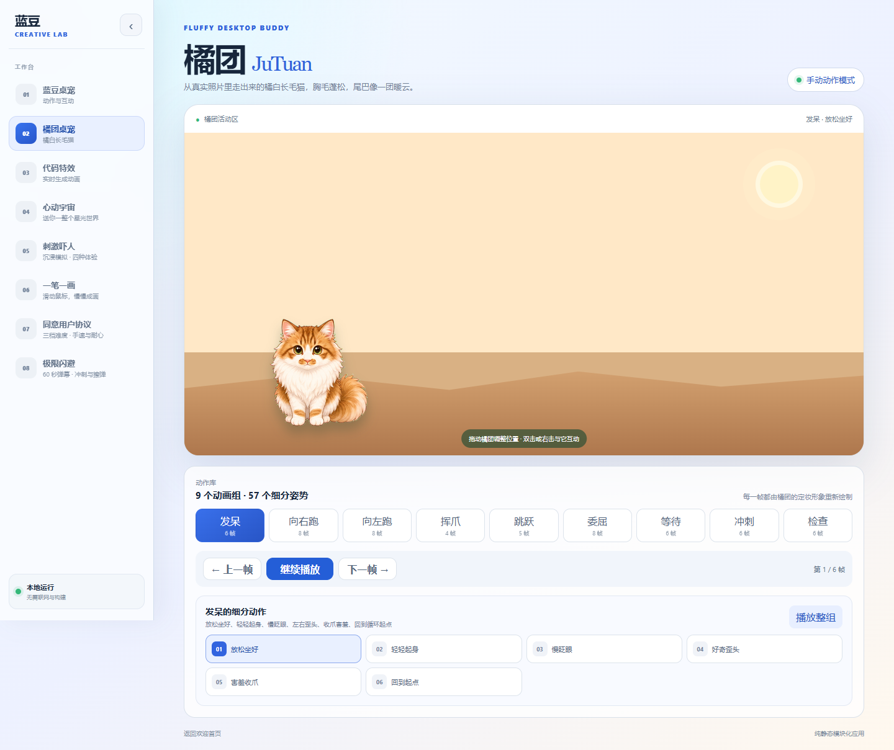
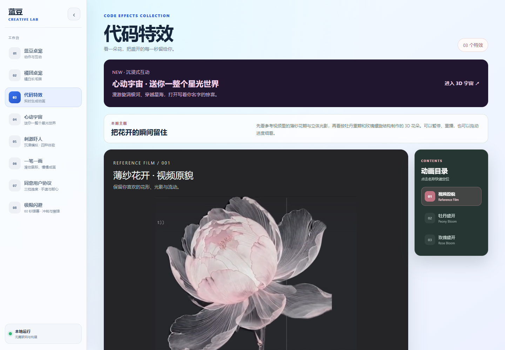
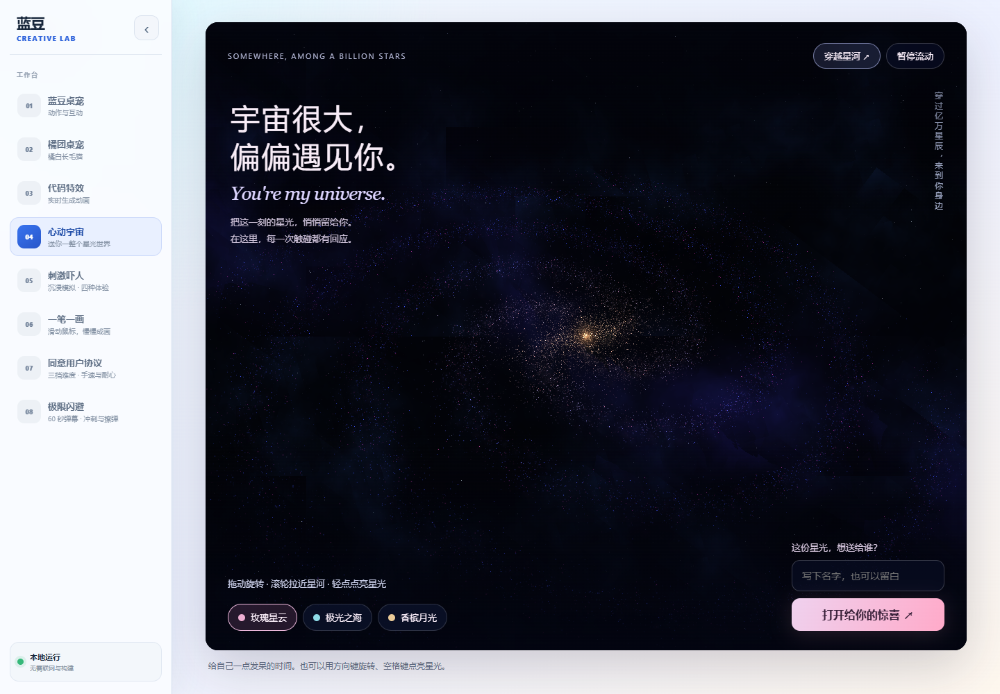
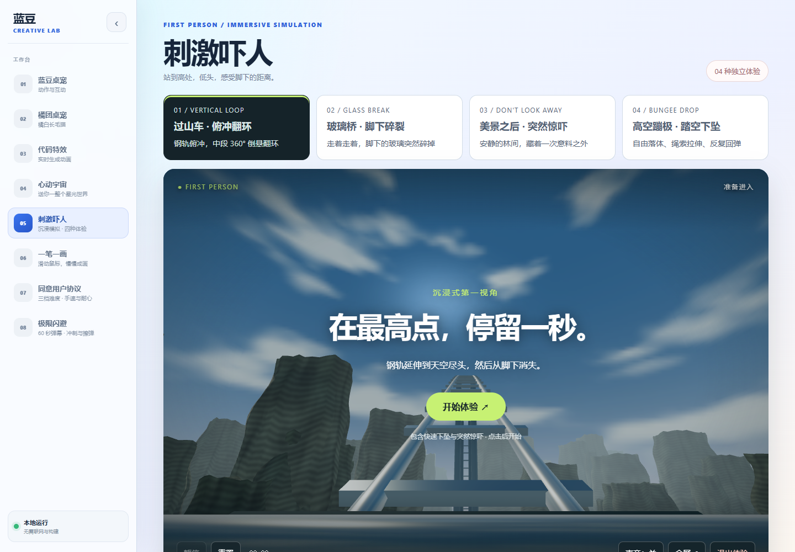
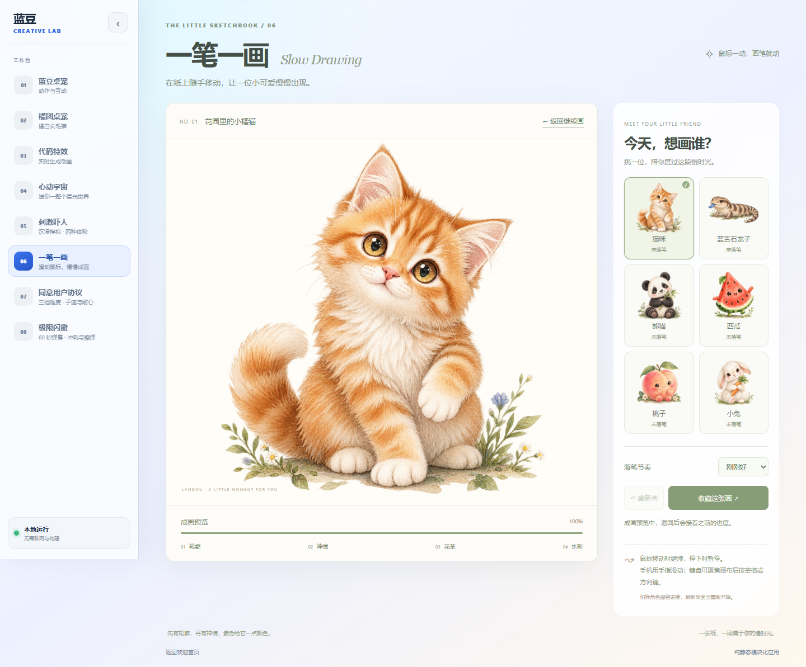
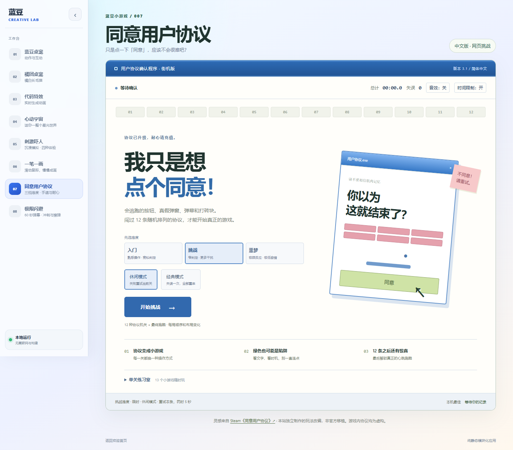
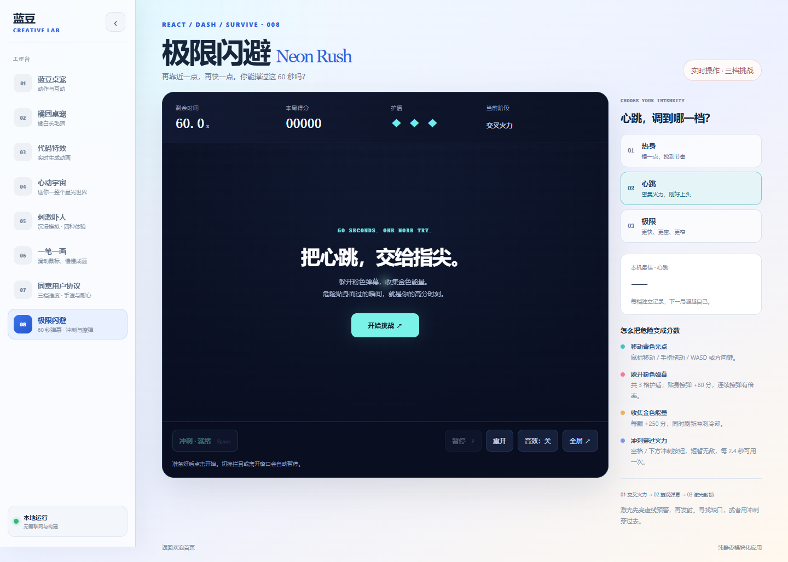
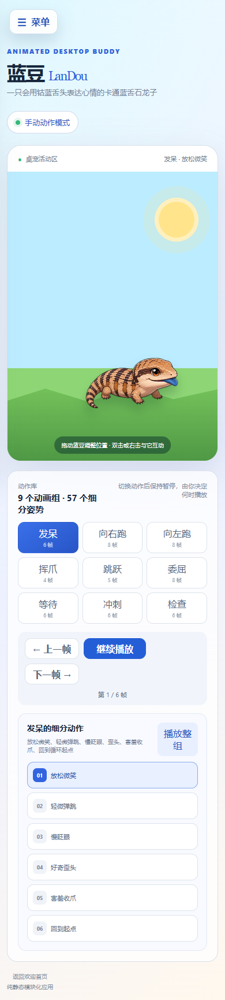

# 蓝豆 · LanDou Creative Lab

一个把桌宠陪伴、动态特效、互动绘画和小游戏放在一起的创意网站。你可以陪蓝豆和橘团发呆、挥爪，看一朵花慢慢盛开，在星海里漫游，也可以画一张水彩画，或挑战自己的反应速度。

网站采用纯静态页面，支持电脑和手机浏览器，无需构建或连接后端。启动本地静态服务器后，就能进入这个小小的创意工作台。



## 网站里有什么

从[欢迎首页](./index.html)进入工作台后，通过侧边栏切换八个栏目。

| 栏目 | 体验内容 | 页面入口 |
| --- | --- | --- |
| 蓝豆桌宠 | 和卡通蓝舌石龙子互动，选择动作、逐帧欣赏 | [进入蓝豆桌宠](./workspace.html#playground) |
| 橘团桌宠 | 陪橘白长毛猫玩耍，看看它的表情和姿势 | [进入橘团桌宠](./workspace.html#cat) |
| 代码特效 | 欣赏薄纱花开视频，以及牡丹、玫瑰的动态盛开 | [进入代码特效](./workspace.html#effects) |
| 心动宇宙 | 旋转银河、点亮星光，打开写着名字的惊喜信笺 | [进入心动宇宙](./workspace.html#surprise) |
| 刺激吓人 | 第一视角体验过山车、玻璃桥、林间惊吓和蹦极 | [进入刺激吓人](./workspace.html#thrill) |
| 一笔一画 | 移动鼠标或滑动手指，让水彩插画逐步完成 | [进入一笔一画](./workspace.html#light) |
| 同意用户协议 | 在不断变化的「同意」机关中闯关 | [进入协议挑战](./workspace.html#agreement) |
| 极限闪避 | 躲避弹幕、收集能量，完成 60 秒生存挑战 | [进入极限闪避](./workspace.html#dodge) |

## 图片演示与玩法

以下截图来自当前本地页面；动画、绘画进度和游戏画面会随操作变化。

### 蓝豆与橘团：有表情的小伙伴

蓝豆是一只会吐出钴蓝舌头的卡通蓝舌石龙子；橘团是一只胸毛蓬松、尾巴像暖云的橘白长毛猫。两只桌宠各有 **9 个动画组、57 个细分姿势**，包括发呆、左右跑动、挥爪、跳跃、委屈、等待、冲刺和检查。

- 拖动桌宠可以调整位置，双击与它互动，右击打开巡游、休息等菜单。
- 点击动作组或细分姿势后保持暂停，可以逐帧查看，也可以播放整组。
- 动作由你选择，不会随机切换，适合慢慢欣赏角色的每一个小表情。





### 代码特效：把花开的瞬间留住

画廊提供 **薄纱花开参考视频、牡丹「白玉重瓣」、玫瑰「螺旋心事」**三项内容。参考视频保留原画面的花形与光影，牡丹和玫瑰则在浏览器中实时呈现立体花瓣与盛开过程。

可以暂停、重播、调整播放速度，或拖动进度细看每个阶段；立体花朵支持拖动和方向键旋转观看。右侧动画目录可以快速定位想看的花。



### 心动宇宙：送你一整个星光世界

在互动银河中拖动旋转视角，触碰或用空格点亮星光，再试试「穿越星河」。输入一个名字，还能打开专属的惊喜信笺，把这片星海送给自己或在意的人。



### 刺激吓人：四种第一视角体验

这里提供四个独立的浏览器 3D 场景：**过山车俯冲翻环、玻璃桥脚下碎裂、美景之后突然惊吓、高空蹦极踏空下坠**。过山车包含 360° 垂直翻环，蹦极包含自由落体、绳索拉伸和反复回弹。

点击「开始体验」后才播放。拖动或按方向键转头，空格暂停，Esc 停止；也可以重置、全屏或开启声音。切换栏目或进入后台会停止当前播放。画面为实时模拟场景。



### 一笔一画：慢慢画出一位小可爱

从 **猫咪、蓝舌石龙子、熊猫、西瓜、桃子、小兔**六套水彩画稿中挑一张，在纸面移动鼠标即可推进绘制，无需按住，也无需沿轮廓描线。手机上用手指滑动，键盘可在聚焦画布后按空格或方向键。

画面依次完成轮廓、神情、花草和水彩四个阶段。支持三档落笔节奏、成画预览、重新绘制，以及 **1200 × 1020 PNG 导出**。切换角色会保留本次页面会话中的进度，刷新页面会重新开始。



### 同意用户协议：只是点一下「同意」？

把看似普通的协议确认变成一场手速与耐心挑战：逃跑按钮、真假弹窗、打地鼠、接物、转盘、洗牌追踪、打砖块、飞行和弹幕等机关轮番登场。完成 **12 种协议关卡**后，解锁最后的心跳跑酷；单关练习室可以直接体验全部 13 个小游戏。

- 难度分为入门、挑战、噩梦，可以搭配休闲或经典模式。
- 休闲模式失误罚时后重试本关，经典模式失误后从第一关重来。
- 支持时间限制开关、提示、暂停和音效；离开窗口会自动暂停。
- 最佳成绩按难度、模式和限时设置保存在本机浏览器中。

玩法灵感来自 Steam《同意用户协议》，由本站独立制作改编。游戏内的协议均为虚构。



### 极限闪避：把心跳交给指尖

控制青色光点，躲开粉色弹幕、收集金色能量，坚持 **60 秒**。挑战依次进入交叉火力、旋涡弹幕和激光封锁，贴身擦弹可以加分，冲刺能短暂无敌。

| 操作 | 方法 |
| --- | --- |
| 移动 | 鼠标移动、触屏拖动、WASD 或方向键 |
| 冲刺 | 空格或冲刺按钮，冷却 2.4 秒 |
| 暂停 | P、Esc 或暂停按钮 |
| 选择难度 | 热身、心跳、极限三档 |

每局有 3 格护盾，收集能量还能刷新冲刺冷却。各档最佳得分保存在本机，支持全屏和可选音效；切换栏目或离开窗口会自动暂停。



### 手机也能玩

网站会根据屏幕宽度调整布局。手机上通过「菜单」展开侧边栏，使用触屏操作桌宠、绘画和小游戏。



## 本地体验

在本目录打开终端，启动静态服务器：

```powershell
python -m http.server 4173
```

然后在浏览器访问 [http://localhost:4173/](http://localhost:4173/)。从仓库根目录启动时，也可以直接指定网站目录：

```powershell
python -m http.server 4173 --directory pet-work/blue-tongue-skink/web
```

页面使用 JavaScript 模块，请通过静态服务器访问。无需执行 `npm install` 或构建；图片、视频和 Three.js 运行库都随网站保存在本地，主要功能可离线体验。3D 栏目需要浏览器支持 WebGL。

## 项目结构

```text
web/
├── index.html              # 欢迎首页
├── workspace.html          # 八个栏目的工作台
├── styles/                 # 全局变量、布局和组件样式
├── scripts/
│   ├── components/         # 侧边栏等通用组件
│   ├── features/           # 桌宠、绘画、游戏等功能
│   ├── effects/            # 花朵、银河等动态场景
│   ├── data/               # 桌宠动作与画稿配置
│   └── vendor/             # 本地三维运行库
├── assets/                 # 图片、视频、动画预览等资源
│   └── screenshots/readme/ # 本说明使用的页面截图
├── ju-tuan-cat/             # 橘团图集及制作资源
├── spritesheet.webp        # 蓝豆动画图集
└── README.md               # 网站介绍与体验指南
```

技术实现以 HTML、CSS 和原生 JavaScript 为基础，结合 Canvas 与 Three.js 呈现动画、绘画、游戏和 3D 场景。
